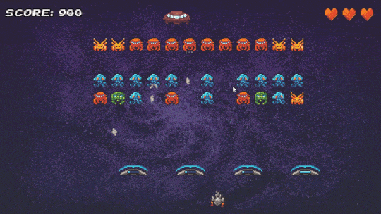

# Galaxy Conquerors

## Introduction

Galaxy Conquerors is a Space Invaders inspired game development project. It was made as a final assignment for Team Programming in Java classes.

## Features

### Gameplay

    * Game Loop
    * Entity management system
    * Enemy behaviour
    * Shooting and movement
    * Score and scoreboard
    * Win/Loose conditions
    * Animated sprites
    * Seed based enemy arrangement

### Art

    * 2D handmade game assets
    * Music and sound effects

## Technologies

* [LibGDX](https://libgdx.com/)

## Requirements

* Java 11+